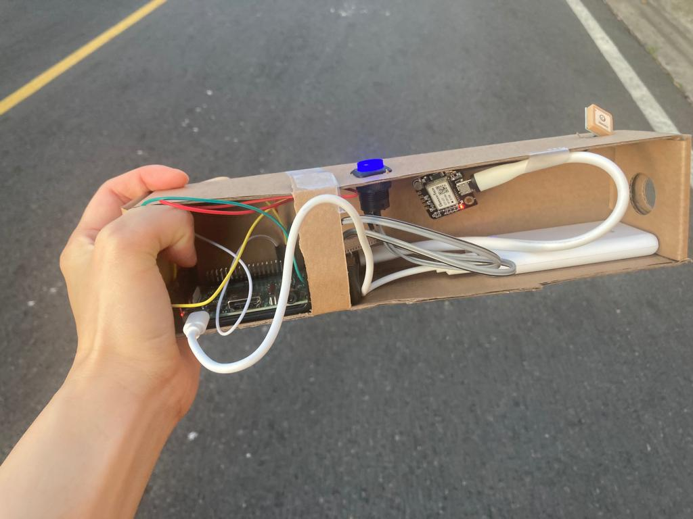

# Running GPS tracker

Get your running time metrics using custom pinned checkpoint on Google Map.

## Table of Contents

1. [Overview](#Overview)
1. [Hardware](#Hardware)
1. [Usage](#Usage)
1. [Tech Stack](#Tech-Stack)

# Hardware:

- Raspberry pi 3B
- [GPS NEO-6M](https://www.amazon.com/gp/product/B07P8YMVNT/ref=ppx_yo_dt_b_asin_title_o01_s01?ie=UTF8&psc=1)
- LED Start/Stop button

## Usage

### Set checkpoints on UI

### Press button to start and press button to stop

### Retreat time metrics after running

